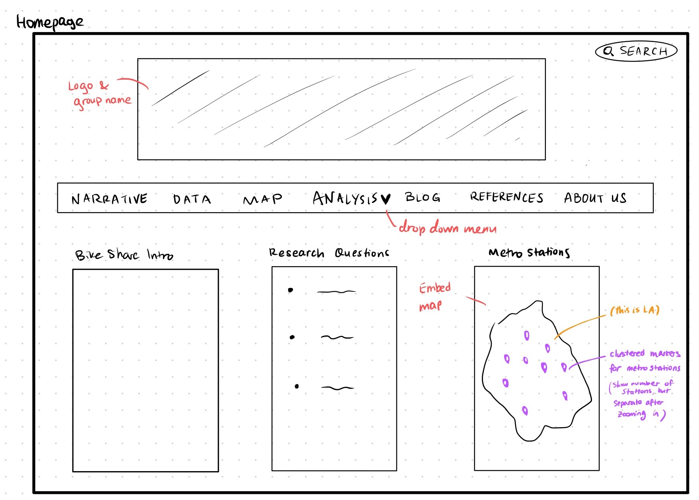
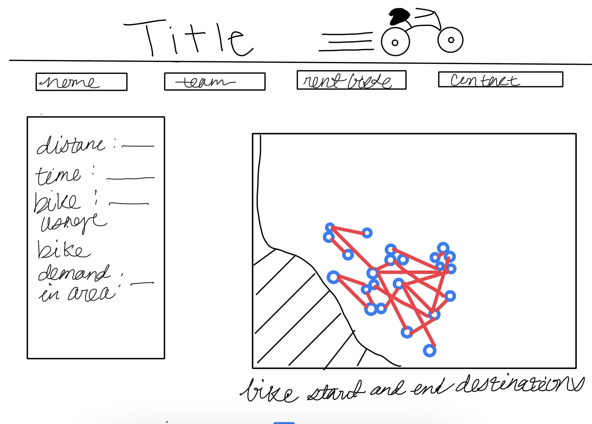
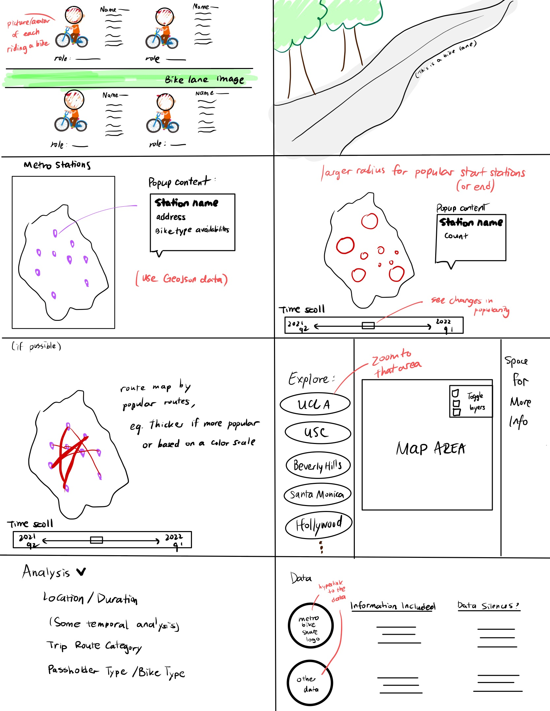
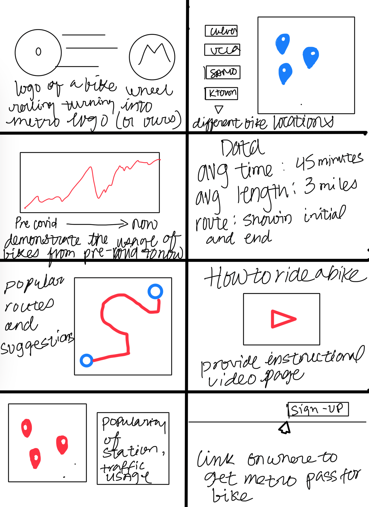

# Week 4 Part 2: UX Design
 
## Mind Maps
 
| Tianna Chan | Leonela Aguilar | Irvin Ramirez | Michelle Kung |
|:---:|:---:|:---:|:---:|
| ||  | x  |
| This mind map contains the homepage of our website. It includes the different tabs we want and we can have a small section for live metro station info obtained in the GeoJSON file provided on the metro data website. | This mind map contains a header with the group name and the title of the project with an image background in the banner. The tabs are pages for the user to navigate the website. A map with markers is immediately visible with a description of our project right next to it. The clickable modules on the bottom show the different regions with more specific details and highlights. | This map contains a homepage of our website with the header being the title of our project followed by links below to redirect you to different parts to navigate the website. Proceed with two drop-down boxes, one being for the region/city and the other for the recipe. Thus changing the left-hand column being the information regarding the region demographics and how well the recipe and the right-hand side directs you to the city/region on the map. | x |
 
## Crazy Eights
 
| Tianna Chan | Leonela Aguilar | Irvin Ramirez | Michelle Kung |
|:---:|:---:|:---:|:---:|
|  |  |  | x  |
| Some thoughts about how to present our trend maps with different layers, markers, and popups. Also thinking of having buttons on the left that zoom in to specific regions of LA, and on the right having some space for more info of the region when the user clicked on the button.| The website will contain unique images and modules that will help us organize our research creatively. The challenging part of this task is how to create a site without too many clusters of words. | These are some ideas I had to add some unique flare to our website everything is mainly stylistic, though some may pose a challenge depending on how much knowledge of code we have and to utilize it to our advantage. | x |
 
## Storyboard
 

