# Week 4 Part 2: UX Design

## Mind Maps

| Tianna Chan | Leonela Aguilar | Irvin Ramirez | Michelle Kung |
|:---:|:---:|:---:|:---:|
| 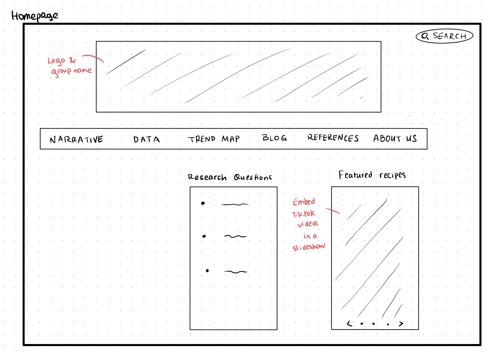|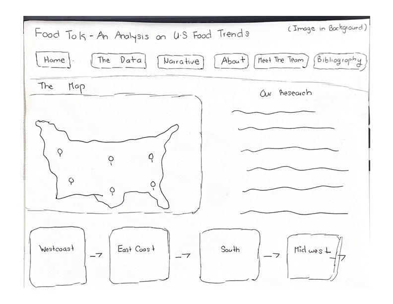| 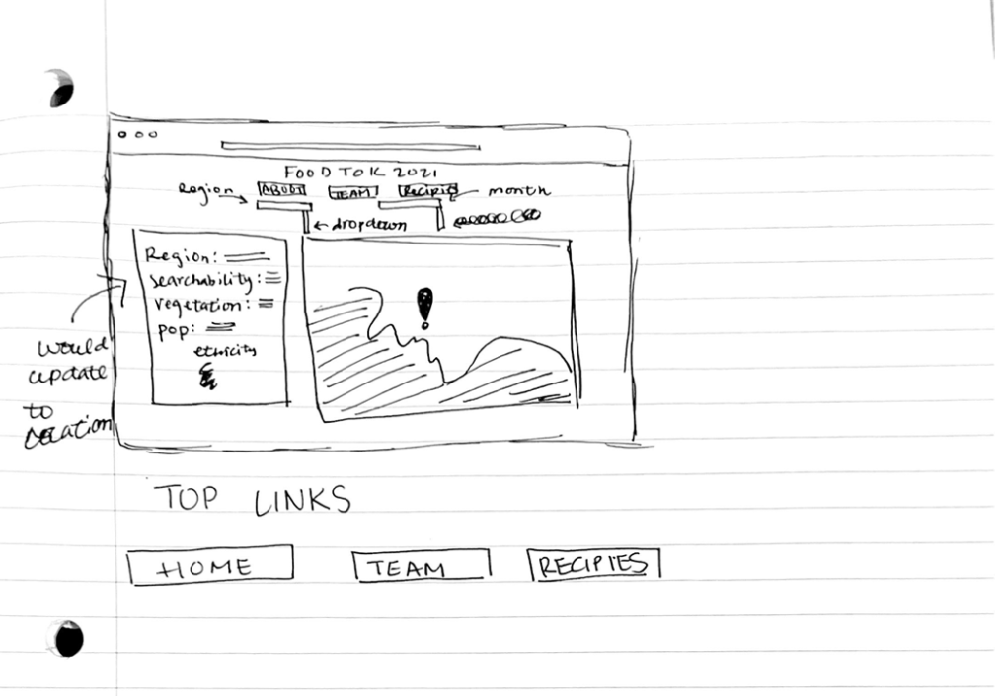 | x  |
| This mind map contains the homepage of our website. It includes the different tabs we want and we want to engage audience by embedding TikTok videos in a slideshow. | This mind map contains a header with the group name and the title of project with an image background in the banner. The tabs are pages for the user to navigate the website. A map with markers is immediately visible with a description of our project right next to it. The clickable modules on the bottom show the different regions with more specific details and highlights. | This map contains a homepage of our website with he header being the title of our project followed by links below to redirect you to diffrent parts to navigate the website. Proceeding with two drop down boxes, one being for the region/city and the other the recipe. Thus chaging the left hand column being the information regarding the region demographics and how well the recipe and the right hand side directing you to the city/region on the map. | x | 

## Crazy Eights

| Tianna Chan | Leonela Aguilar | Irvin Ramirez | Michelle Kung |
|:---:|:---:|:---:|:---:|
| 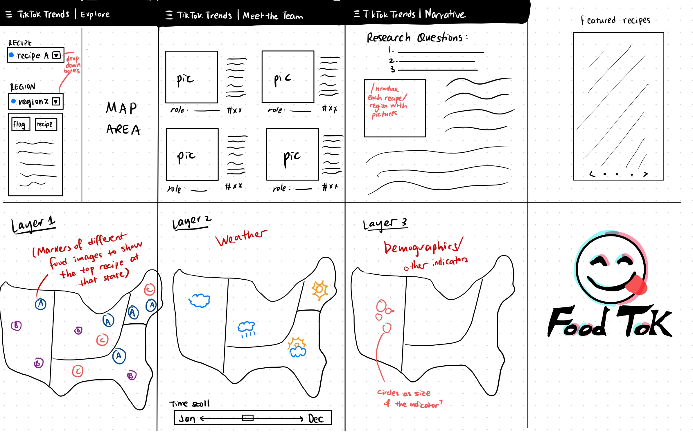 | 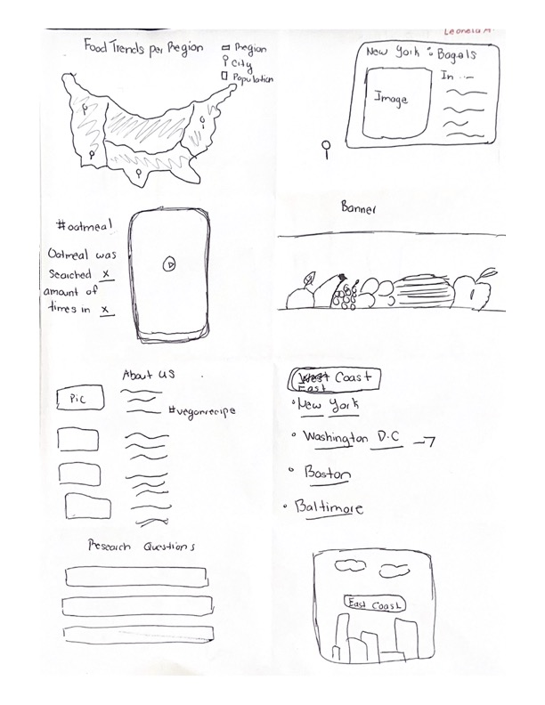 | 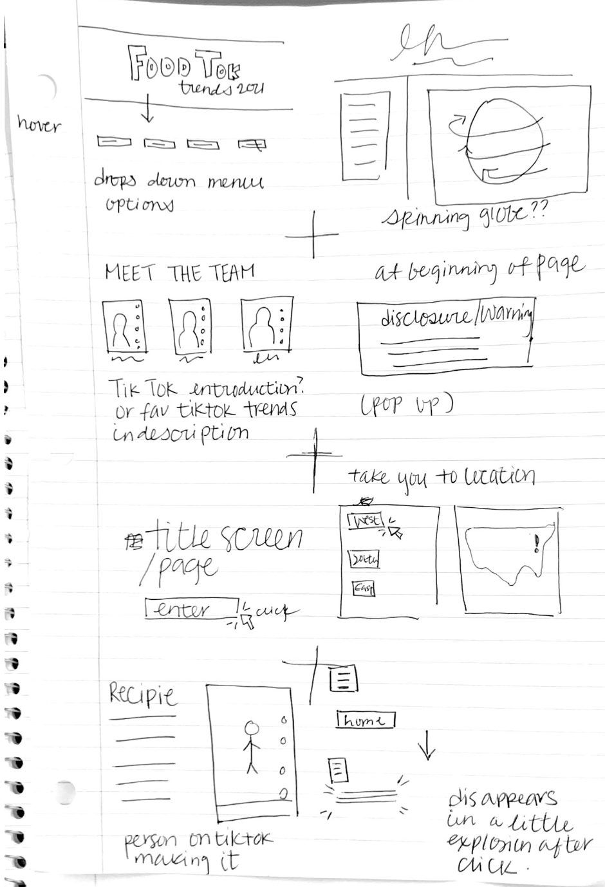 | x  |
| Some thoughts about how to present our trend maps. Different layers and markers. Also includes a potential team logo that mimics TikTok.| The website will contain unique images and modules that will help our organize our research creatively. The challenging part of this task is how to create a site without too many clusters of words. | These are some ideas I had to add some unique flare to our website everything ins mainly stylystic, though some may pose a challenge depding on how much knowledge of code we have and to utilize it to our advantage. | x | 

## Storyboard

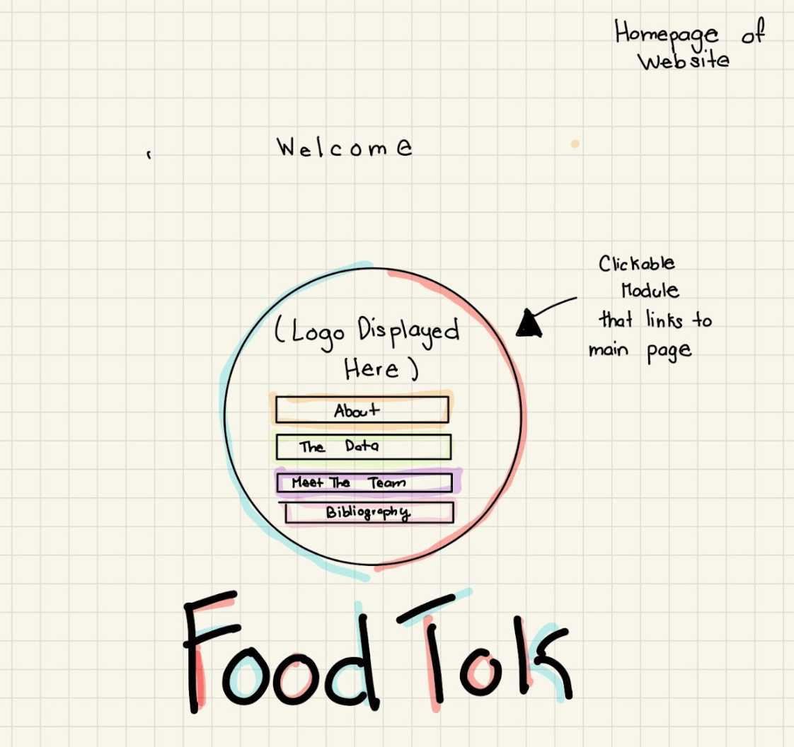
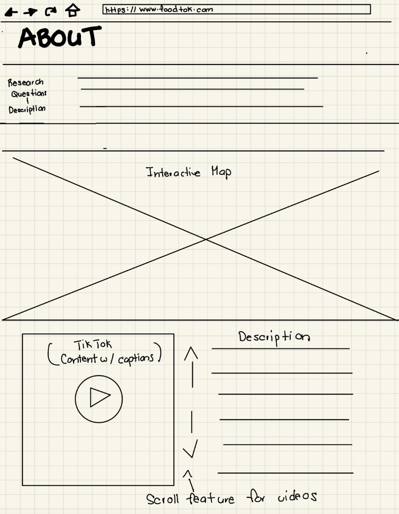
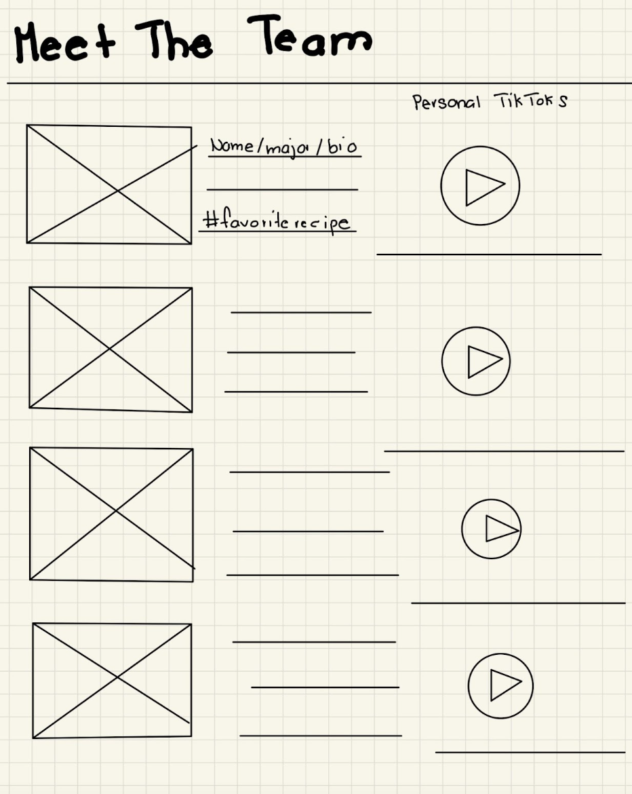
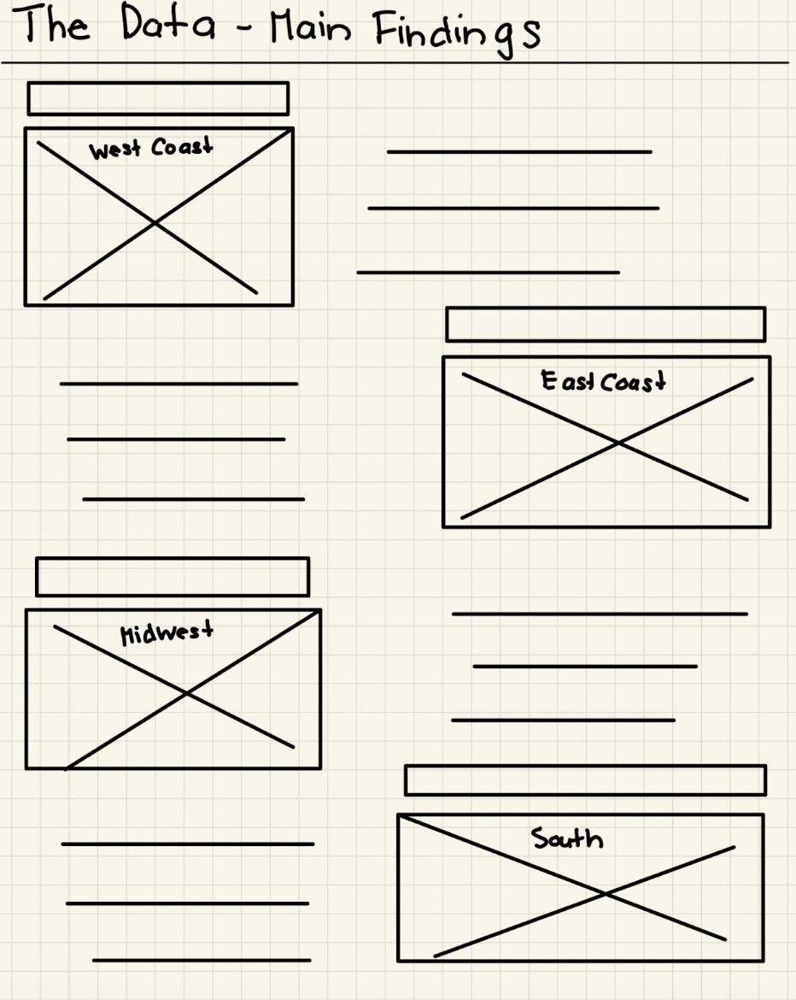
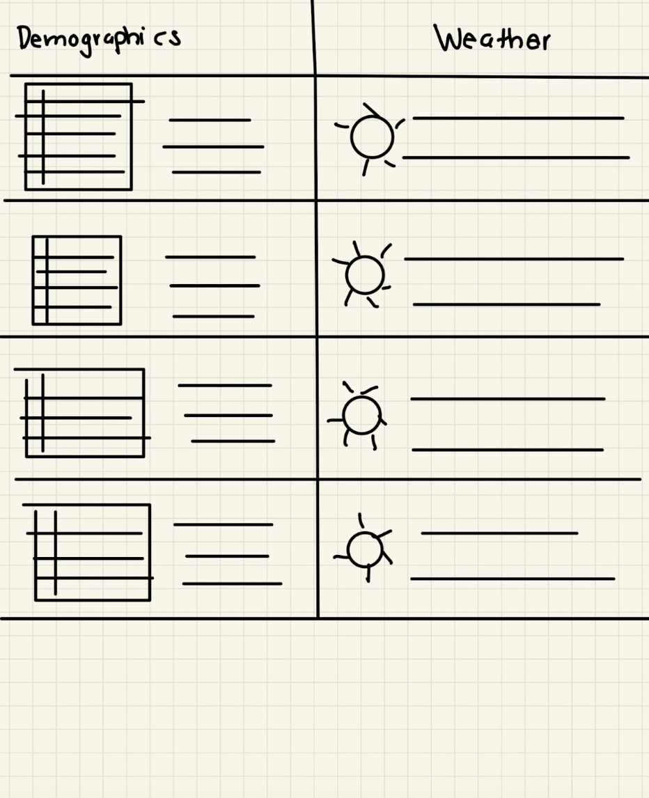
